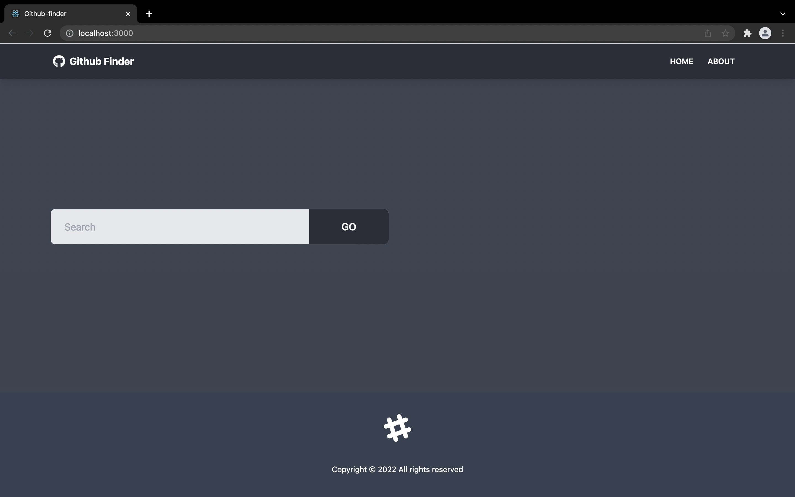
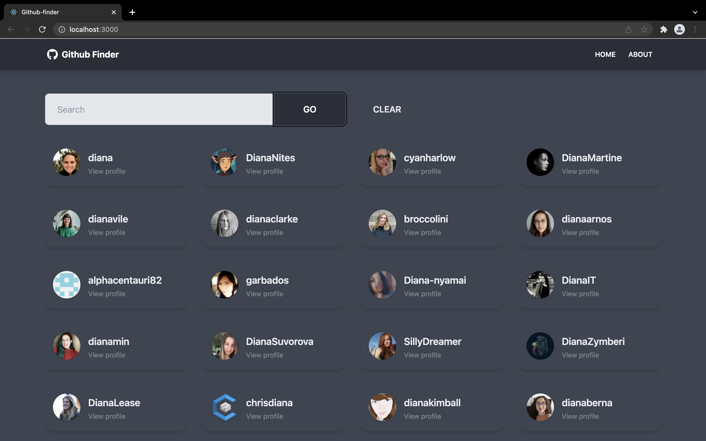
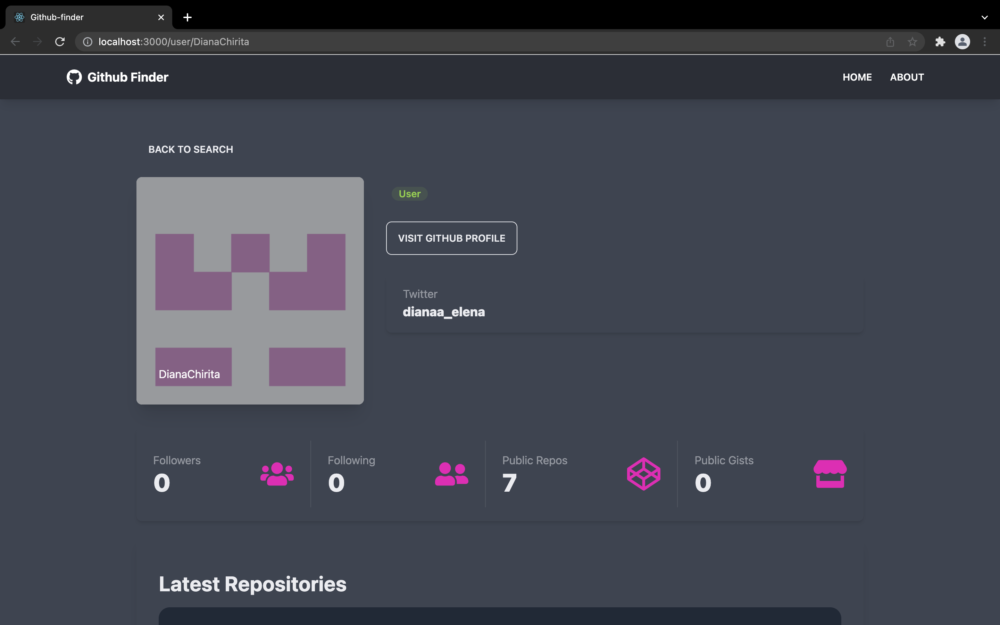
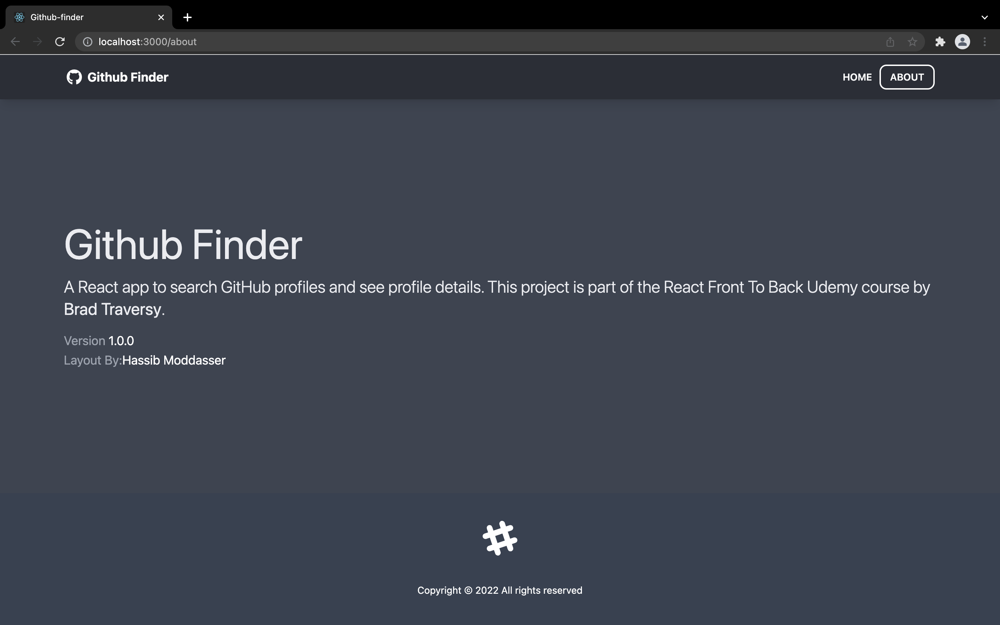

# Github finder app

This project was built based on "React Front To Back 2022" course on Udemy.

## General information

The "Github finder" application uses the Github API to search for users, list their details and their repositories.

It has the following pages:

- [Home](#home)
- [About](#about)
- [User](#user)
- [NotFound](#notfound)

### Home

This page displays a search bar in which the user can search Github users by their username. The page displays the results from the Github API based on the matched characters.

After entering a certain name into the input field, the page is populated with the results from the API

The user can see more details for a particular Github user by clicking the "See profile" button. This will lead to the user page.

### User

In this page, more information about a Github user can be seen. This information includes the profile picture, description, social links, number of followers etc. At the bottom of the page, the list of the user's latest repositories is also shown.

### NotFound

If the user intends to navigate to a nonexisting link, a "Not found" page is shown.

### About

The app has also a page in which more details about the applications are shown.

